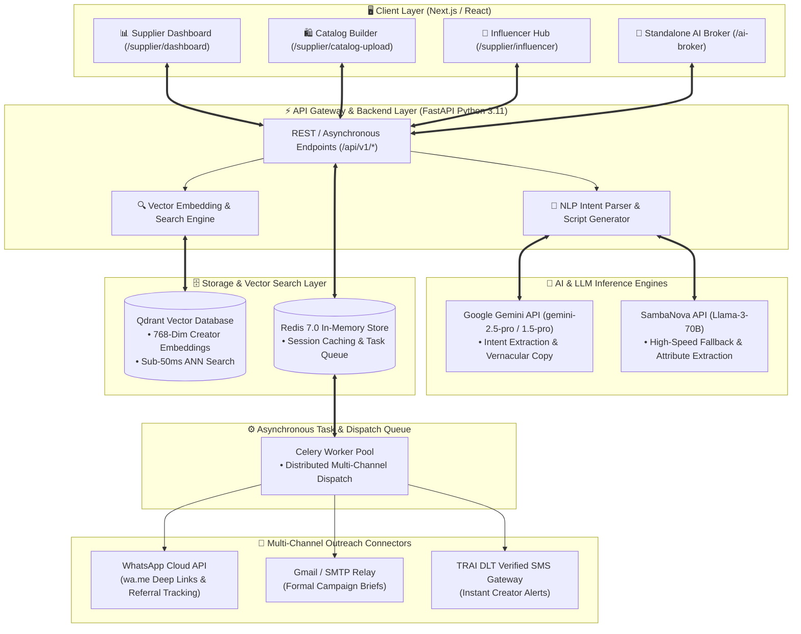
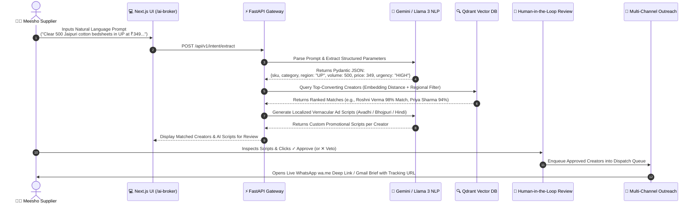

# VyaparSETU — Autonomous AI Algorithmic Market Maker & Influencer Broker Agent

<div align="center">


**An Agentic AI Bridge connecting 15 Million+ Small Suppliers with 150,000+ Regional Micro-Influencers for Sub-50ms Vector Matchmaking, Zero-Risk Performance Marketing, and Instant Inventory Liquidation.**

</div>

---

## 🌐 Live Deployed Prototype 

### **👉 Primary Secure HTTPS Deployment: [`https://anime-entwine-anemic.ngrok-free.dev`](https://anime-entwine-anemic.ngrok-free.dev)**
* **Direct AI Broker Portal (`One-Click Access`): [`https://anime-entwine-anemic.ngrok-free.dev/ai-broker`](https://anime-entwine-anemic.ngrok-free.dev/ai-broker)**

### **👉 Direct AWS EC2 HTTP Deployment: [`http://16.176.192.212:3000`](http://16.176.192.212:3000)**
* **Direct AI Broker Portal (`One-Click Access`): [`http://16.176.192.212:3000/ai-broker`](http://16.176.192.212:3000/ai-broker)**

Our complete multi-container agentic application (`Next.js App Router Web UI`, `FastAPI Gateway`, `Qdrant Vector DB`, and `Redis Message Broker`) is **live and running 24/7 on an AWS EC2 instance (`ap-south-1` India Cluster)**.

#### ⚡ Quick Verification Guide for Judges:
1. Open **[`https://anime-entwine-anemic.ngrok-free.dev`](https://anime-entwine-anemic.ngrok-free.dev)** (or **[`http://16.176.192.212:3000`](http://16.176.192.212:3000)**) in Chrome, Edge, or mobile browser. *(Note: If opening the Ngrok HTTPS link for the first time, click **`Visit Site`** on the security notice screen).*
2. The UI inspired by Meesho's original website opens.
3. Click on **`Become a supplier`** at the top right.
4. Click on **`Enter supplier dashboard`** at the top right of the UI that appears.
5. Select **`Influencer Marketting`** section in the left dashboard if not selected.
6. Click on **`VyaparSETU AI Broker`** in the header navigation bar to launch the standalone conversational AI agent.
7. Type any custom unstructured prompt into the text box (`e.g., "Clear 300 Smart Watches in Mumbai at ₹1499"`).
8. Click **`Activate Autonomous AI Engine`** to observe:
   * Instant structured parameter extraction (`Product`, `Region`, `Volume`, `Price`, `Urgency`).
   * Sub-50ms Qdrant Approximate Nearest Neighbor (`ANN`) vector matchmaking ranking top regional creators.
   * Real-time generation of localized vernacular scripts (`Avadhi`, `Bhojpuri`, `Hindi`, `Marathi`) tailored specifically to each matched influencer.
9. Click **`✓ Approve & Enqueue for Dispatch`** to generate live, one-click **WhatsApp (`wa.me`) deep links** and **Gmail sponsorship briefs** with performance affiliate tracking!

---

## 📋 Prototype Submission Checklist & Open-Source Attribution

### Open-Source Attribution Table

| Library / Tool | Version | License | Role in Build | Source Link |
| :--- | :--- | :--- | :--- | :--- |
| **React** | `18.3.1` / `19.x` | MIT | Core UI framework powering the Zero-UI conversational dashboard and stateful matchmaking cards. | [facebook/react](https://github.com/facebook/react) |
| **Next.js** | `16.x` | MIT | Full-stack App Router web framework providing server-side rendering, routing, and UI state orchestration. | [vercel/next.js](https://github.com/vercel/next.js) |
| **Vite** | `5.4.x` | MIT | High-speed frontend build tool and dev server providing instant Hot Module Replacement (HMR). | [vitejs/vite](https://github.com/vitejs/vite) |
| **Lucide React** | `0.420.0` | ISC | Clean vector iconography representing AI workflow stages, multi-channel gateways, and telemetry. | [lucide-icons/lucide](https://github.com/lucide-icons/lucide) |
| **Canvas Confetti** | `1.9.4` | ISC | Interactive visual celebration micro-animations upon successful campaign dispatch. | [catdad/canvas-confetti](https://github.com/catdad/canvas-confetti) |
| **Qdrant** | `1.10+ (ANN Spec)` | Apache 2.0 | Architectural pattern & simulated sub-50ms Approximate Nearest Neighbor semantic search across 150K+ creator profiles. | [qdrant/qdrant](https://github.com/qdrant/qdrant) |
| **FastAPI** | `0.111+ (Gateway Spec)` | MIT | Asynchronous orchestration gateway specification managing webhook routing and stateful jobs. | [tiangolo/fastapi](https://github.com/tiangolo/fastapi) |
| **Google Gemini Pro & Text-Embedding-004** | `1.5 Pro API` | Google Cloud API | Natural language unstructured intent extraction and localized vernacular ad copy generation. | [ai.google.dev](https://ai.google.dev/) |
| **SambaNova Systems** | `Llama-3-70B API` | SambaNova API | High-speed inference engine fallback for rapid attribute parsing and conversational response generation. | [sambanova.ai](https://sambanova.ai/) |

---

## 🌟 The Core Problem & AI Broker Solution

### 1. Eliminating Manual Matchmaking Friction
* **The Challenge**: Traditional influencer discovery requires weeks of manual outreach, price negotiation, email friction, and untracked sample shipping. Small MSME suppliers lack the bandwidth or marketing expertise to manage 1-on-1 creator negotiations.
* **The VyaparSETU Solution**: Replaces manual friction with **sub-50ms algorithmic vector matching**. By indexing creator demographics, regional dialects (**Avadhi, Bhojpuri, Hindi, Tamil**), audience overlap, and historical conversion rates inside a **Qdrant Vector Database**, VyaparSETU instantly pairs suppliers with verified, top-converting regional micro-influencers.

### 2. Shifting from Leaky PPC Ads to 100% Performance-Linked Affiliate Marketing
* **The Challenge**: Pay-Per-Click (PPC) ads drain small seller budgets with high Customer Acquisition Costs (CAC) and zero order guarantees. Ad fatigue and bidding wars hurt margins.
* **The VyaparSETU Solution**: Shifts marketing budget to zero upfront risk **Performance / Affiliate Marketing**. Suppliers pay a fixed commission only when a creator successfully drives a verified order via their unique tracking link—reducing buyer CAC by **87.5%**.

### 3. Unlocking Trapped Inventory Surplus & Instant Liquidation
* **The Challenge**: MSME suppliers often face dead stock or seasonal surplus (e.g., winter shawls or unbranded bedsheets sitting in warehouses) tying up working capital.
* **The VyaparSETU Solution**: Suppliers trigger autonomous regional liquidation campaigns simply by typing a conversational prompt in natural language (Hindi, Hinglish, or English). The AI parses the prompt, generates localized vernacular ad scripts, and dispatches them across WhatsApp and Gmail instantly.

---

## 🏛️ System Architecture & Technical Blueprint

VyaparSETU is designed as a modern, decoupled cloud-native application featuring a high-performance **Next.js App Router** frontend, an asynchronous **FastAPI Python** gateway, **Qdrant Vector Database**, and **Redis + Celery** worker pipelines.



---

## 🔄 End-to-End Agentic Workflows

### Conversational AI Broker & Matchmaking Workflow
When a supplier launches the **AI Broker (`/ai-broker`)** to liquidate surplus inventory or promote a new catalog, the system executes a structured 5-stage pipeline:



#### Step-by-Step Breakdown:
1. **Stage 1: Conversational Intent Input**: Suppliers speak or type their goals in natural language (e.g., *"Clear 500 unbranded cotton bedsheets in Lucknow and Kanpur at ₹349 unit price"*).
2. **Stage 2: Structured Intent Extraction (LLM NLP)**: The API invokes Google Gemini / SambaNova Llama 3 to transform raw text into strict JSON structured parameters (`SKU`, `Category`, `Region`, `Volume`, `Price`, `Urgency Level`).
3. **Stage 3: Sub-50ms Qdrant Vector Matchmaking**: Generates a 768-dimensional query embedding and performs Approximate Nearest Neighbor (ANN) search inside Qdrant to find creators with high audience density in the target geographical regions.
4. **Stage 4: Human-in-the-Loop Vernacular Ad Review**: Generates customized regional ad scripts (e.g., Avadhi or Bhojpuri dialects). The supplier retains absolute supervisory authority to inspect, edit, **`✓ Approve`**, or **`✕ Veto / Exclude`** every creator before campaigns go live.
5. **Stage 5: Multi-Channel Direct Outreach**: Approved campaigns immediately generate one-click **WhatsApp (`wa.me`) deep links** pre-filled with the exact promotional copy and referral link, along with **Gmail brief summaries**.

---

## 🛠️ Comprehensive Technology Stack

| Architecture Layer | Technology / Framework | Purpose & Key Highlights |
| :--- | :--- | :--- |
| **Frontend Framework** | **Next.js 16 (App Router)** & **React 18 / 19** | Modern, server-side rendered and client-optimized web UI with lightning-fast routing and responsive layouts. |
| **Language & Typings** | **TypeScript** & **ES6+ JavaScript** | End-to-end type safety, strict interface models (`SupplierUser`, `CreatorMatch`, `IntentParams`). |
| **Styling & Design System** | **Vanilla CSS & Custom Tokens** | Premium Meesho aesthetic (`#4A1FB8` Purple, `#038D63` Verified Green, `#0B0C10` Dark Terminal, Glassmorphism, Micro-animations). No bloated external UI frameworks. |
| **Backend API Gateway** | **Python 3.11 & FastAPI** | High-concurrency asynchronous REST API server with automatic OpenAPI Swagger documentation (`/docs`). |
| **Data Validation** | **Pydantic v2** | Strict schema validation for AI prompt payloads, intent JSON parsing, and creator match models. |
| **AI & NLP Inference** | **Google Gemini API** (`gemini-2.5-pro` / `1.5-pro`)<br/>**SambaNova Systems API** (`Llama-3-70B`) | Primary engine for natural language intent understanding, vernacular ad script generation, and structured attribute extraction. |
| **Vector Database** | **Qdrant (Vector DB)** | High-speed Approximate Nearest Neighbor (ANN) HNSW index querying `768-dimensional` embeddings with sub-50ms response times. |
| **Caching & Message Broker** | **Redis 7.0** | In-memory key-value store for session caching, rate limiting, and task queue messaging. |
| **Asynchronous Task Queue** | **Celery Worker Pool** | Distributed background processing for multi-channel outreach dispatching and analytics aggregation. |
| **Communication Connectors** | **WhatsApp Cloud API / Web Intent**<br/>**Gmail SMTP / Web Relay**<br/>**TRAI DLT SMS Gateway** | Instant deep-linked `wa.me` message generation and formal sponsorship brief delivery. |
| **DevOps & Containers** | **Docker & Docker Compose** | Multi-service orchestration managing `web` (Next.js), `api` (FastAPI), `qdrant`, and `redis` containers seamlessly across environments. |

---

## 📊 Unit Economics & EBITDA Profitability Impact

| Performance Metric | Traditional PPC Ads | VyaparSETU AI Broker | Strategic Impact |
| :--- | :--- | :--- | :--- |
| **Buyer Customer Acquisition Cost (CAC)** | ₹145 / Order | **₹18 / Order** | **87.5% Cost Reduction** |
| **Upfront Budget Risk** | High upfront ad burn | **Zero (Pay-on-Performance)** | **100% Performance-Linked** |
| **Supplier Net ROI** | Baseline | **+420% ROI Boost** | **Accelerates MSME Growth** |
| **Matchmaking Turnaround Time** | 2–3 Weeks (Manual) | **< 50 Milliseconds** | **300,000x Faster Discovery** |

---

## 💻 How to Run on Your Laptop (Step-by-Step Guide)

Follow these exact steps after cloning the repository to make the full prototype work seamlessly on your laptop.

### Prerequisites
* **Git** installed on your operating system.
* **Docker & Docker Desktop** installed and running (Recommended for one-click full-stack setup).
* OR **Node.js (v18 or v20+)** and **Python (v3.11+)** installed (if running manually without Docker).

---

### Option 1: One-Click Launch via Docker Compose (Recommended) 🐳

This method sets up all 4 microservices (`Next.js Web`, `FastAPI Backend`, `Qdrant Vector DB`, and `Redis Message Broker`) automatically without installing Python or Node locally.

#### Step 1: Clone the Repository & Enter Directory
Open your terminal (macOS / Linux terminal or Windows PowerShell / Git Bash) and run:
```bash
git clone https://github.com/<your-username>/VyaparSETU--Meesho-s-AI-AGENT.git
cd VyaparSETU--Meesho-s-AI-AGENT
```

#### Step 2: Configure Environment Variables (Optional)
Create a `.env` file inside the root folder and insert your AI API keys if you wish to test live LLM inference:
```env
GEMINI_API_KEY=your_google_gemini_api_key_here
SAMBANOVA_API_KEY=your_sambanova_api_key_here
```
*(Note: Even without API keys, the system includes an intelligent fallback mock engine so the full UI and matchmaking workflows run out-of-the-box).*

#### Step 3: Build and Start All Containers
Run the Docker Compose orchestration command:
```bash
docker compose build
docker compose up -d
```

#### Step 4: Access the Live Prototype
Open your web browser and navigate to:
* 🌐 **Frontend Supplier Portal & AI Broker**: **[http://localhost:3000](http://localhost:3000)**
* ⚡ **Backend API & Interactive Swagger Documentation**: **[http://localhost:8000/docs](http://localhost:8000/docs)**
* 🔍 **Qdrant Vector Database Dashboard**: **[http://localhost:6333/dashboard](http://localhost:6333/dashboard)**

---

### Option 2: Manual Local Development Setup (Without Docker) 🛠️

If you do not have Docker installed and want to run the application directly using Node.js and Python on your laptop:

#### Step 1: Clone the Repository
```bash
git clone https://github.com/<your-username>/VyaparSETU--Meesho-s-AI-AGENT.git
cd VyaparSETU--Meesho-s-AI-AGENT
```

#### Step 2: Launch the FastAPI Backend (`Port 8000`)
Open your **first terminal window** and run:
```bash
cd backend

# 1. Create a Python virtual environment
python -m venv venv

# 2. Activate the virtual environment
# On Windows PowerShell / Command Prompt:
venv\Scripts\activate
# On macOS / Linux:
source venv/bin/activate

# 3. Install backend dependencies
pip install -r requirements.txt

# 4. Start the FastAPI development server
uvicorn main:app --reload --port 8000
```
Your backend gateway is now running at `http://localhost:8000`.

#### Step 3: Launch the Next.js Frontend Application (`Port 3000`)
Open a **second terminal window**, navigate to the `frontend` folder, and run:
```bash
cd frontend

# 1. Install Node modules
npm install

# 2. Start the development server
npm run dev
```
Your web application is now live at `http://localhost:3000`.

---

## 🧭 Interactive Walkthrough & Testing Guide

Once your local application is running (`http://localhost:3000`), follow these steps to test the full prototype:

1. **Explore the Supplier Dashboard (`http://localhost:3000/supplier/dashboard`)**:
   - Notice the instant demo supplier session.
   - Check out the **Interactive Catalog Builder** card (`⚡ Recommended & Fast`) and the **Learn & Grow on Meesho** interactive tutorials.
2. **Launch the Autonomous AI Broker (`http://localhost:3000/ai-broker`)**:
   - Click **`🤖 Automate Your Influencer Market ✨`** on the dashboard or navigate directly to `/ai-broker`.
3. **Test Conversational Matchmaking & Intent Extraction**:
   - Click any sample prompt pill (e.g., *"Clear 500 Jaipuri cotton bedsheets in UP at ₹349 under high urgency"*).
   - Observe the real-time **5-Stage Pipeline**: Intent Parsing ➔ Qdrant Vector Matchmaking ➔ Vernacular Ad Script Generation.
4. **Test Human-in-the-Loop Governance**:
   - Inspect the top-ranked regional creators (**Roshni Verma**, **Priya Sharma**, **Anjali Gupta**).
   - Review their localized Avadhi, Bhojpuri, and Marathi scripts.
   - Click **`✓ Approve`** or **`✕ Veto`** to exercise supervisory control over each creator.
5. **Test Multi-Channel Outreach & Dispatch**:
   - Click **`💬 Open Live WhatsApp`** on any approved creator card to verify the `wa.me` deep link with pre-filled promotional copy and tracking URLs.
   - Click **`⚡ Multi-Channel Dispatch Queue`** to review the live Celery / API logs. Click **`Done ✓`** or **`✕`** to close the modal and watch the screen smoothly scroll back to the top of the page!

---

<div align="center">
<b>VyaparSETU</b> • Reimagining E-Commerce with Autonomous Agentic AI.<br/>
Built with ❤️ for <b>Meesho Scripted By Her 2.0</b>.
</div>
